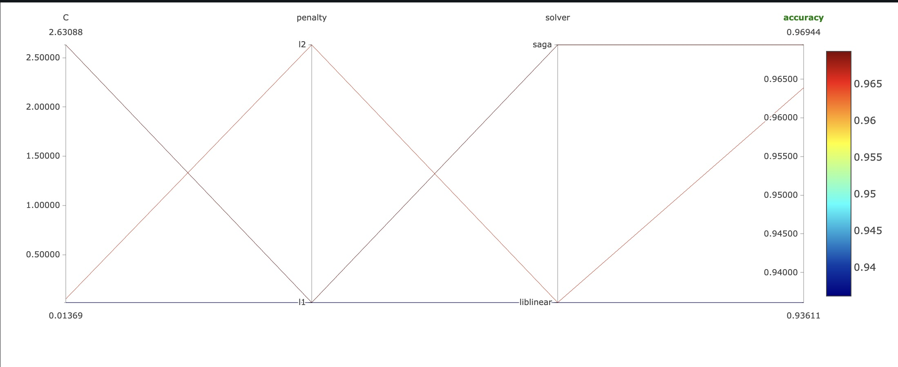
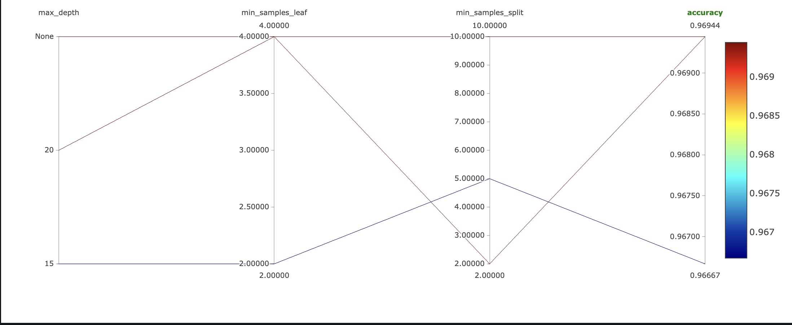
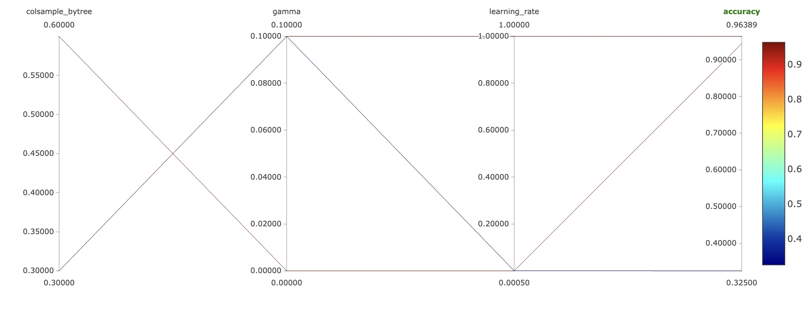

## <a name="container">Experiment tracking</a>
- **General Info**  

The project aims to track different experiments using **mlfow** on the *digits-classification* dataset. 


The project consists of 3 main parts:
1. *Building server-client network, images, containers.*
2. *Tracking experiments using mlflow (running containers).*
3. *Saving best model artifacts to local storage.*

-----
- **Quick Instructions**  

1. Clone the repo, go `/Module3` directory:
```bash
git clone https://github.com/khazratoff/MLE_HWs.git
cd Module3
```
2. Create a mlflow network (any network but in our case it's mlflow):
```bash
docker network create mlflow-network
```
3. Build the server and client images:
```bash
docker build -f server/Dockerfile -t server-image .
```
```bash
docker build -f client/Dockerfile -t client-image .
```
4. Run the server container:
```bash
docker run -p 5000:5000 -d --name mlflow-server --network mlflow-network server-image
```
- *Server container runs with `-p 5000:5000` flag to make it accessible to the mlflow-ui within local computer*
- *`--name` flag gives server a unique name that ensures accessibilty within client container*
- *`--network` defines server-client network*
5. Run the client container:
```bash
 docker run -v $(pwd)/best_models:/mlflow_app/best_models  -d --name mlflow-client --network mlflow-network client-image
 ```
 - *`-v` flag used for mounting `/best_models` folder as it saves best model artifacts after each successfull experiment*  
6. Go to [**mlflow-ui**](http://localhost:5000)
> After successfull running experiments make sure that `/best_models/` folder created in the root directory that contains best model artifacts.
If you want to see what's going behind the scenes run ```docker logs <container-name>```
-----
- **Vizualizations on experiments**  
1. *Experiment visualization on Logistic Regression model*  

  

2. *Experiment visualization on Random Forests model*  

  

3. *Experiment visualization on XGBoost model*  


