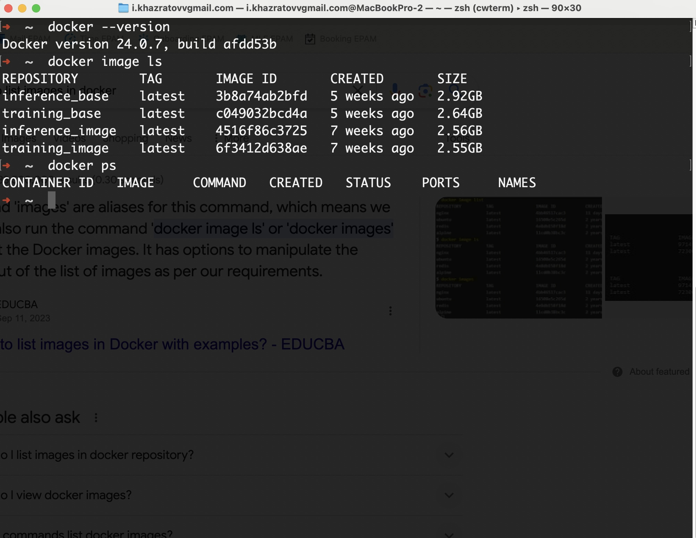
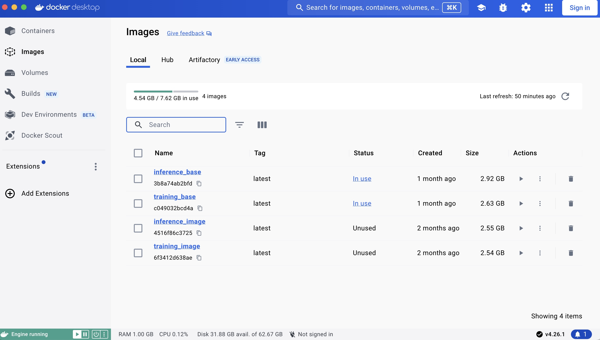
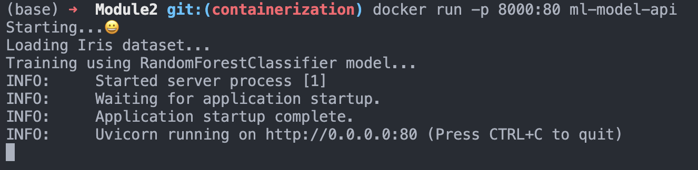
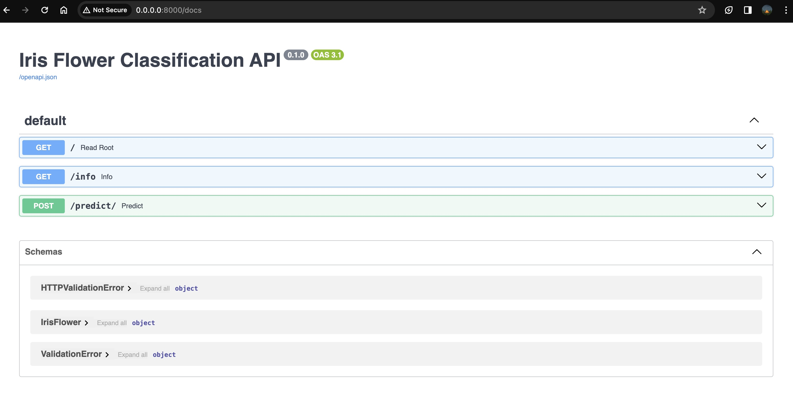
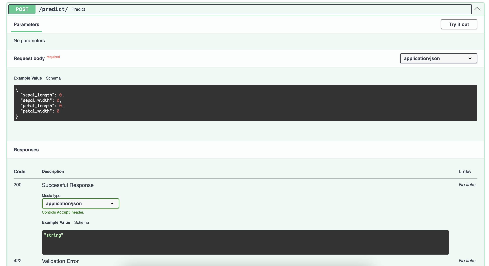
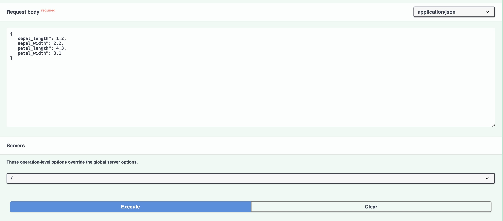
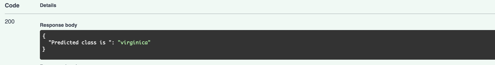

## ML Engineering by Modules
- **List of Modules**:
    1. [*Core Ideas & Preparation for the course*](#core-ideas)
    


### <a name="core-ideas">Core Ideas & Preparation for the course</a>
- **Installing docker** <br>
On macOS system I used terminal (command-line) to install Docker with the help of Homebrew. I've had Homebrew already installed and because the Docker for macOS is a GUI tool the command `brew install docker` doesn't work. So I used `--cask` option of the `brew install` command that's responsible for installing GUI tools. Here's the full command I used:
```bash
brew install --cask docker
```
**Alternatively we can use GUI option of installation (drag-and-dropping)* <br>
After installing Docker I validated successfull installation using ```docker --version``` command that gives the current version of my Docker.
- Working on terminal
- Working on Docker Desktop GUI
## <a name="container">Containerization</a>
In this module, the main goal was to create a development environment that sufficient for effective iterations (version control, variables, environment management) with the help of Docker on top of the Linux. In my case, my aim was to create (or install any pretrained) ML model that trains on data, gives predictions as an API and what's more important is the whole process should be run in the isolated container (development environment) that built on the Linux image.
But before diving into the project itself the question arises: 
> *"Why do we use docker, why do we need such separate environments (virtual env, python venv, etc)"*
- *The best possible answer would be: Docker and virtual envs provides benefits such as isolation, reproducibility, dependency management, portability, scalability, environment consistency, and security.* 
### Project Overview and Quick Instructions
All necessary files and code for this module can be found Module2 directory includes `Dockerfile` ,`requiremenets.txt` files at the root and `app.py` which is main script of the project in `/src` directory.
<p>Now let's go through the step-by-step instructions on how all works

1. Clone this repo to your local machine using this command: 

```bash
git clone https://github.com/khazratoff/MLE_HWs.git
```
2. By default  git switches to the `main` branch but the Module2 project written in another `containerization` branch to provide seperability of modules. So, let's switch to this:
```bash
git switch containeraztion
```
3. Make sure that `Module2` folder appears on project directory. Now, it's time to build our Docker image using `Dockerfile` in that folder. First of all start the Docker engine using this command (in MacOS):
```bash
open -a Docker.app
```
Make sure you're in same directory as Dockerfile does and run this command to build an image:
```bash
docker build -t model-api-image .
```
After successful run you got an image built on top of Ubuntu base image.<br>
4. Run the container:
```bash
docker run -p 8000:80 model-api-image 
```
Docker uses this parameter (`-p <out:port>:<in_port>`) to connect ports inside and outside.
<p>
Afer successfull run you can see info (output) and on your terminal, something like that:


-  Next, go to the https://localhost:8000 and https://localhost:8000/info to check server is working.
<br>
-  Finally to get predictions of the model (RandomForestClassifier model trained on Iris flowers dataset) open https://localhost:8000/docs:
- 
You can see only one POST method there named `predict`, click on it:
- 
There's a "Try it out" button over there to test model API:
- 
Give values to features and execute and you'll see the result like this:
- 
<br><p>**Looking forward to get your feedback, and if you don't get any desired results please let me know.*
